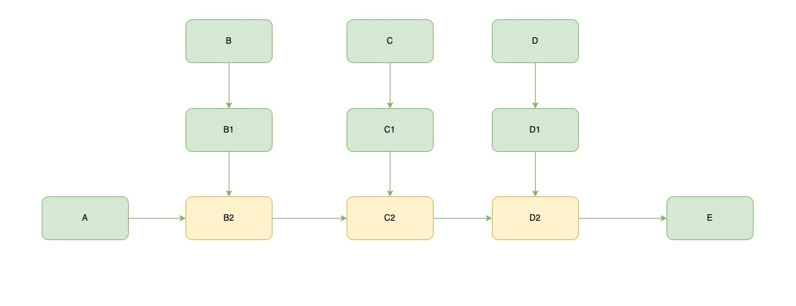
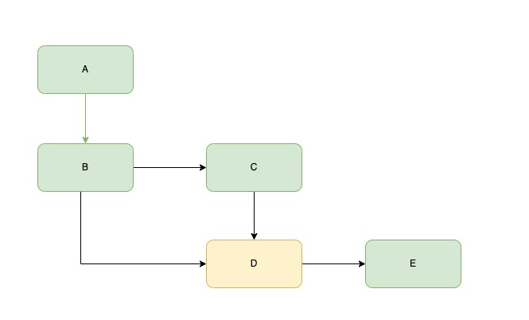
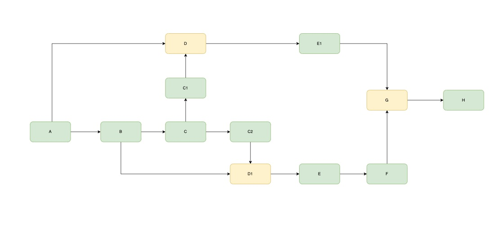
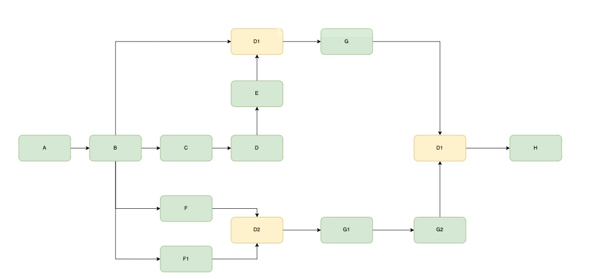

# sky-flow

|index|Module|Description|
|----|------------|------------|
|1|node-definition|节点定义模块
|2|node-manager|节点管理
|3|node-delegate|节点执行器实现
|4|node-process|流程
|5|node-context|节点上下文
|6|node-engine|节点引擎
|7|node-designer|节点编写模块

### 流程引擎解决

业务流程图（1） 
 
[测试用例1](sky-flow-test/src/test/java/org/sky/flow/run/RunMuIndex.java)

业务流程图（2） 
 
[测试用例2](sky-flow-test/src/test/java/org/sky/flow/run/RunMuIndex2.java)

业务流程图（3） 
 
[测试用例3](sky-flow-test/src/test/java/org/sky/flow/run/RunMuIndex3.java)

业务流程图（4） 
 
[测试用例4](sky-flow-test/src/test/java/org/sky/flow/run/RunMuIndex4.java)